# SparseCI-24 Dataset
> **Source Database:**
> - [QMe14S](https://doi.org/10.1021/acs.jpclett.5c00839) - A comprehensive spectral dataset for small organic molecules


A curated benchmark set of 24 molecules with compact sparse CI wavefunctions suitable for quantum computing applications.

## Selection Criteria

All molecules in this dataset satisfy:
- **Neutral singlet ground state** (charge = 0, spin multiplicity = 1)
- **≤6 determinants** in the sparse CI expansion
- **Sub-milliHartree accuracy** (ΔE < 1.0 mHa) compared to full CI in the AutoCAS-selected active space

These criteria identify molecules where a small number of Slater determinants accurately capture the ground-state wavefunction, making them ideal candidates for near-term quantum algorithms.

## Dataset Composition

This dataset contains 24 molecules that passed the selection criteria above:
- **Small organic molecules** (19): Randomly sampled from the [QMe14S](https://doi.org/10.1021/acs.jpclett.5c00839) database and screened for sparse CI suitability (not an exhaustive search of the full database)
- **Diradicals** (5): 1,n-diradical systems

## Summary Table

| Molecule              | Structure                                                      | Composition     |   Atoms |   Mass (amu) |   AOs |   Active Orb (initial) |   Active Orb (AutoCAS) |   CASCI Energy (Eh) |   AutoCAS Energy (Eh) |   Sparse CI Energy (Eh) |   Sparse CI Dets |   ΔE (mHartree) |
|:----------------------|:---------------------------------------------------------------|:----------------|--------:|-------------:|------:|-----------------------:|-----------------------:|--------------------:|----------------------:|------------------------:|-----------------:|----------------:|
| 13Cyclohexadiene      | 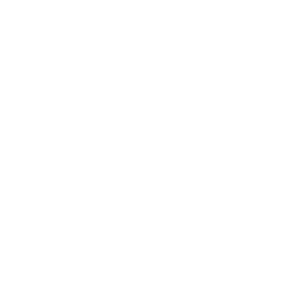           | H8, C6          |      14 |        80.13 |   124 |                     32 |                      3 |             -231.97 |               -231.86 |                 -231.86 |                3 |          0.0153 |
| Norbornene            | 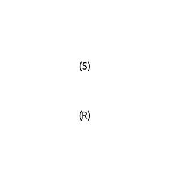                       | H10, C7         |      17 |        94.16 |   148 |                     38 |                      2 |            -271.005 |               -270.89 |                 -270.89 |                2 |               0 |
| mol001078_data_100967 | 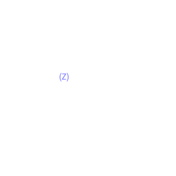 | H7, O1, Br1, C4 |      13 |          151 |   132 |                     36 |                      4 |            -2802.88 |              -2802.79 |                -2802.79 |                5 |          0.4298 |
| mol023000_data_120697 | 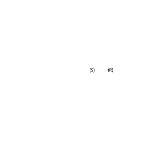 | H9, N1, C6, O2  |      18 |       127.14 |   171 |                     45 |                      3 |            -436.755 |                -436.6 |                  -436.6 |                2 |          0.2138 |
| mol023237_data_12091  | 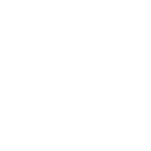   | H6, O1, S1, C4  |      12 |       102.15 |   118 |                     30 |                      3 |            -627.392 |               -627.29 |                -627.289 |                3 |          0.9565 |
| mol024546_data_122088 | 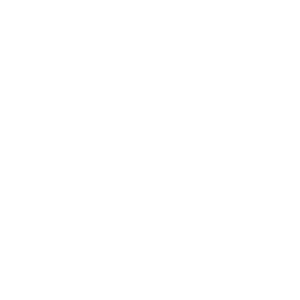 | H9, N1, C5      |      15 |        83.13 |   129 |                     33 |                      2 |            -249.143 |              -249.047 |                -249.047 |                2 |          0.0503 |
| mol026500_data_123847 | 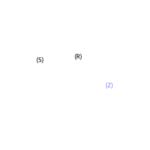 | H11, O2, N1, C6 |      20 |       129.16 |   181 |                     47 |                      4 |            -437.862 |              -437.719 |                -437.718 |                2 |          0.9545 |
| mol027500_data_124747 | 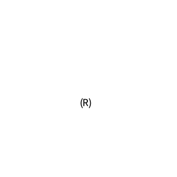 | H7, N1, O2, C6  |      16 |       125.13 |   161 |                     43 |                      4 |            -435.599 |              -435.459 |                -435.458 |                6 |          0.9358 |
| mol033444_data_130096 | 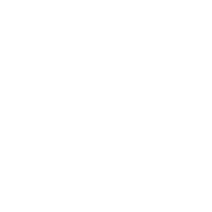 | H4, O1, N2, C3  |      10 |        84.08 |   104 |                     28 |                      3 |            -299.757 |              -299.626 |                -299.626 |                5 |          0.0627 |
| mol033557_data_130198 | 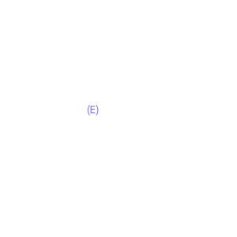 | O1, N1, C2, H5  |       9 |        59.07 |    81 |                     21 |                      3 |            -208.008 |              -207.951 |                -207.951 |                4 |          0.5844 |
| mol033697_data_130323 | 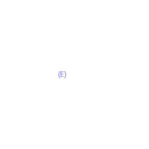 | H2, F2, N2, C1  |       7 |        80.04 |    80 |                     22 |                      3 |            -346.754 |              -346.651 |                -346.651 |                2 |          0.2319 |
| mol037500_data_133747 | 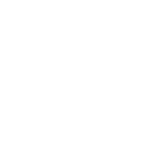 | H8, N4, C5      |      17 |       124.15 |   166 |                     44 |                      3 |            -411.921 |              -411.764 |                -411.764 |                3 |          0.1708 |
| mol041096_data_136984 | 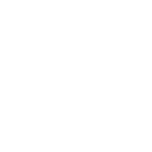 | H4, C2, O4      |      10 |        92.05 |   104 |                     28 |                      4 |            -377.559 |              -377.441 |                -377.441 |                4 |           0.525 |
| mol044000_data_139598 | 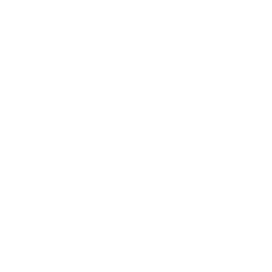 | H14, O1, C8     |      23 |        126.2 |   196 |                     50 |                      2 |            -386.098 |              -385.979 |                -385.979 |                2 |          0.0014 |
| mol083250_data_174922 | 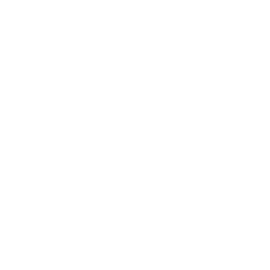 | H5, O1, N1, C2  |       9 |        59.07 |    81 |                     21 |                      3 |            -208.046 |               -207.99 |                 -207.99 |                5 |          0.4375 |
| mol086586_data_177925 | 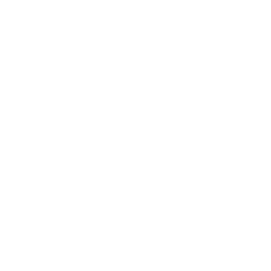 | H5, F1, Si1, C2 |       9 |        76.14 |    85 |                     21 |                      3 |            -467.112 |              -467.071 |                 -467.07 |                4 |          0.6444 |
| mol096521_data_19375  | 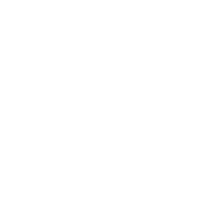   | H3, Br1, O2, C2 |       8 |       138.95 |    98 |                     28 |                      4 |            -2799.69 |              -2799.61 |                -2799.61 |                3 |          0.3334 |
| mol184802_data_98829  | 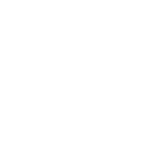   | H3, F1, C2      |       6 |        46.04 |    57 |                     15 |                      2 |            -176.942 |              -176.912 |                -176.912 |                2 |            0.02 |
| ozone                 | 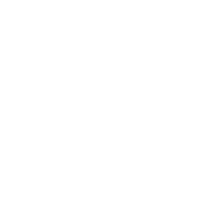                                 | O3              |       3 |           48 |    42 |                     12 |                      5 |             -224.45 |              -224.345 |                -224.345 |                6 |          0.6839 |
| C4H8_diradical        | 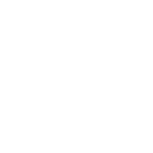               | H8, C4          |      12 |        56.11 |    96 |                     24 |                      2 |            -156.077 |              -156.019 |                -156.019 |                2 |          0.0009 |
| C5H10_diradical       | 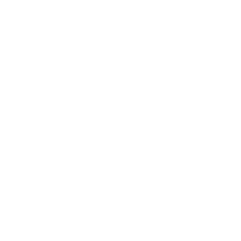             | H10, C5         |      15 |        70.14 |   120 |                     30 |                      2 |            -195.128 |              -195.057 |                -195.057 |                2 |               0 |
| C6H10_diradical       | 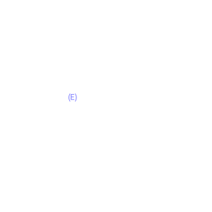             | H10, C6         |      16 |        82.15 |   134 |                     34 |                      2 |             -233.02 |              -232.915 |                -232.915 |                3 |           0.001 |
| C6H12_diradical       | 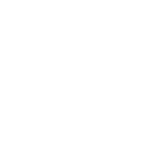             | H12, C6         |      18 |        84.16 |   144 |                     36 |                      2 |            -234.179 |              -234.095 |                -234.095 |                2 |               0 |
| C8H12_diradical       | 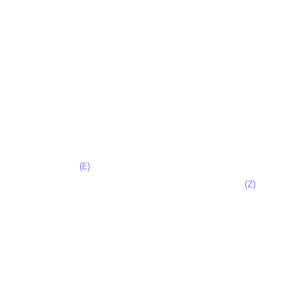             | H12, C8         |      20 |       108.18 |   172 |                     44 |                      2 |            -309.951 |              -309.818 |                -309.818 |                2 |          0.6194 |

## Column Descriptions

| Column | Description |
|--------|-------------|
| Molecule | Molecule identifier |
| Structure | 2D molecular structure image |
| Composition | Atomic composition |
| Atoms | Total number of atoms |
| Mass (amu) | Molecular mass in atomic mass units |
| AOs | Number of atomic orbitals (cc-pVDZ basis) |
| Active Orb (initial) | Initial valence active space size |
| Active Orb (AutoCAS) | AutoCAS-refined active space size |
| CASCI Energy (Eh) | CASCI energy in initial active space (Hartree) |
| AutoCAS Energy (Eh) | CASCI energy in AutoCAS active space (Hartree) |
| Sparse CI Energy (Eh) | Sparse CI energy in AutoCAS active space (Hartree) |
| Sparse CI Dets | Number of determinants in sparse CI wavefunction |
| ΔE (mHartree) | Energy difference between sparse CI and full CASCI (milliHartree) |

## File Structure

```
SparseCI-24/
│
├── README.md                 # This file
├── SparseCI-24.json          # Complete dataset: structures, orbitals,
│                             # Hamiltonians, and sparse CI wavefunctions
│                             # for all 24 molecules
├── regenerate.py             # Script to regenerate the dataset from xyz/
│
├── xyz/                      # Molecular geometries in XYZ format
│   ├── 13Cyclohexadiene.xyz
│   ├── Norbornene.xyz
│   ├── ozone.xyz
│   └── ...                   # (24 XYZ files total)
│
├── images/                   # 2D molecular structure visualizations
│   ├── 13Cyclohexadiene.png
│   ├── Norbornene.png
│   ├── ozone.png
│   └── ...                   # (24 PNG files total)
│
└── raw_output/               # Computation logs from the screening workflow
    ├── 13Cyclohexadiene.out
    ├── Norbornene.out
    ├── ozone.out
    └── ...                   # (24 log files total)
```

## Data Format

The `SparseCI-24.json` file contains an array of molecule records, each with:
- Molecule name
- XYZ coordinates (as string)
- SCF energy (Hartree)
- Molecular structure summary (composition, mass, nuclear repulsion energy)
- Orbital information and active space details
- Hamiltonian summaries (active orbitals, core energy)
- Sparse CI wavefunction (determinants and coefficients)
- Energy benchmarks

## Methodology

Each molecule was processed using the `sample_sci_workflow.py` script, which performs the following steps:

1. **SCF Calculation**: Restricted Hartree-Fock using the cc-pVDZ basis set via QDK/Chemistry.

2. **Initial Active Space Selection**: The valence active space selector identifies active orbitals based on element-specific valence electron and orbital counts.

3. **Initial CASCI**: Full configuration interaction within the initial active space using the MACIS ASCI solver (`macis_asci`), which employs an adaptive sampling CI approach for efficient handling of large active spaces.

4. **AutoCAS Refinement**: Entropy-based active space refinement analyzes single-orbital entropies from the initial CASCI wavefunction to identify a smaller, chemically relevant active space. Orbitals are ranked by their entanglement contribution and grouped into plateaus to determine optimal boundaries.

5. **Final CASCI**: Full CI calculation in the AutoCAS-refined active space produces the reference energy and wavefunction.

6. **Sparse CI Selection**: The sparse CI finder identifies the minimal determinant subset that reproduces the full CASCI energy within 1 mHa tolerance:
   - Determinants are sorted by coefficient magnitude
   - A geometric search (2, 4, 8, ... determinants) brackets the solution
   - Binary refinement locates the smallest count meeting the energy criterion
   - The Projected Multi-Configuration (PMC) calculator evaluates each candidate subset

## Reproducibility

Results were generated using `sample_sci_workflow.py` from [qdk-chemistry](https://github.com/microsoft/qdk-chemistry) at commit [`aab310b`](https://github.com/microsoft/qdk-chemistry/commit/aab310b108342456bf6b1017d01ccb8e31d2d52d).

Typical command:
```bash
python sample_sci_workflow.py \
    --xyz <structure>.xyz \
    --initial-active-space-solver macis_asci \
    --autocas \
    --max-determinants 100
```

Full computation logs are available in the `raw_output/` directory.

## Citation

If you use this dataset, please cite:
- [QDK/Chemistry](https://github.com/microsoft/qdk-chemistry) ([arXiv:2601.15253](https://arxiv.org/abs/2601.15253))
- Original molecule source: [QMe14S database](https://doi.org/10.1021/acs.jpclett.5c00839)

## License

See repository [LICENSE](../../../LICENSE.txt) for terms of use.
